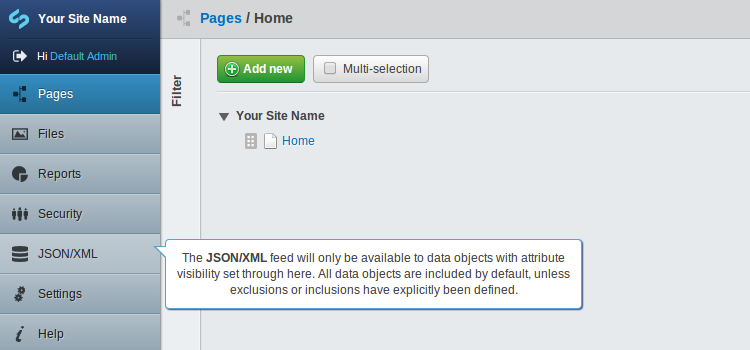
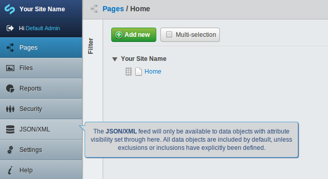

# [adminwesome](https://github.com/nglasl)

_The current release is **1.0.0**._

	A module for SilverStripe which will allow model admin descriptions to appear on mouse over.

## Requirement

* SilverStripe 3.1.X

## Getting Started

* Place the module under your root project directory.
* Define your model admin descriptions.
* `/dev/build`

## Overview

### Model Admin Description

Creating a description, either directly or by extension:

```php
private static $menu_description = 'Description';
```



### CSS Customisation

Apply custom styles to the absolute description element:

```php
AdminwesomeService::customise_css(array(
	'background' => '#D4D6D8',
	'color' => '#304E80'
));
```



More advanced configuration will need to be implemented outside of this service, such as border manipulation.

## Maintainer Contact

	Nathan Glasl, nathan@silverstripe.com.au
